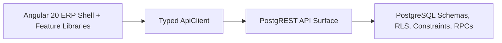
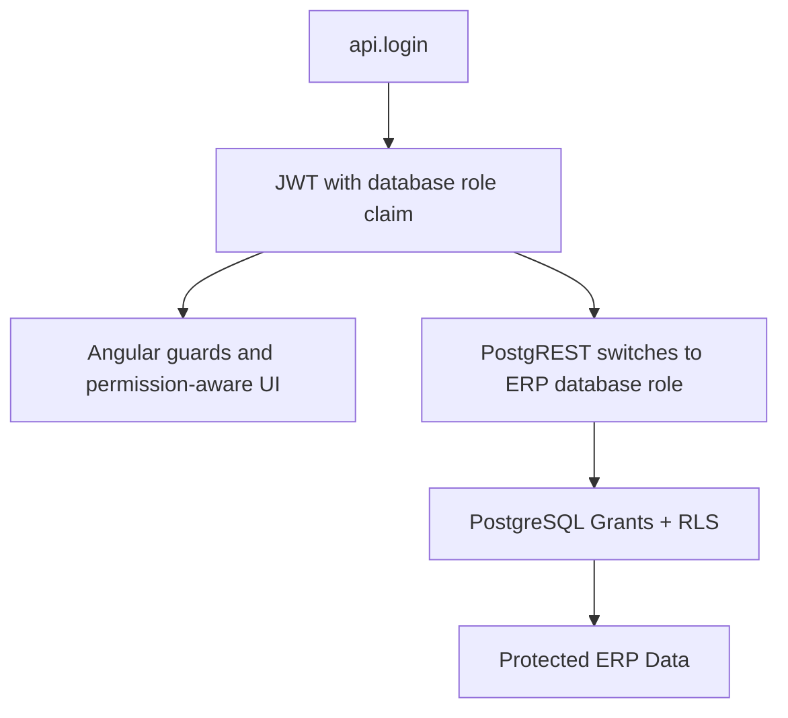
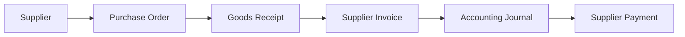
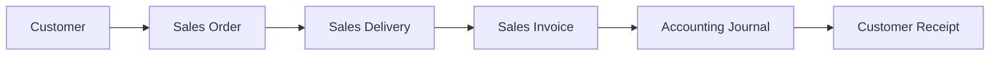
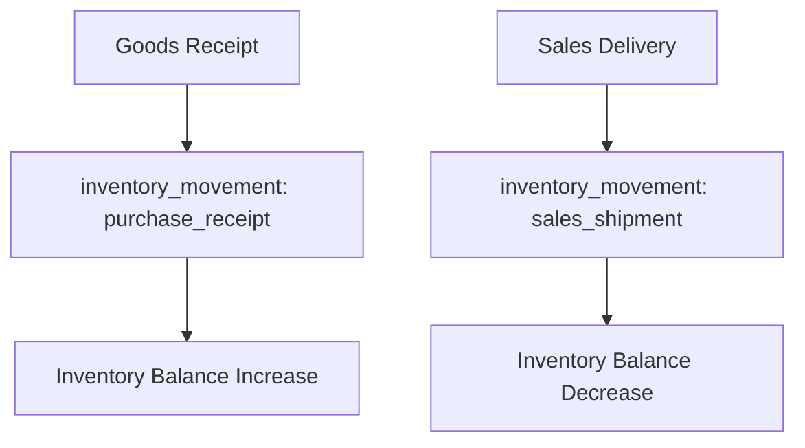
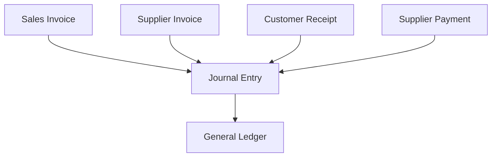

# Daqiq ERP Architecture

This document explains the current Daqiq ERP MVP architecture.

## 1. High-Level Architecture



The frontend is intentionally modular. The backend is intentionally database-centered because PostgREST exposes PostgreSQL views, tables, and RPC functions directly as HTTP resources.

## 2. Frontend Architecture

Main areas:

```text
apps/erp-shell      application composition, shell layout, root routes
libs/core           auth, authorization, navigation, HTTP/API infrastructure
libs/shared         domain-neutral orchestration contracts and CRUD facade base
libs/ui             reusable presentation, PrimeNG-aware controls, forms, tables, feedback
libs/feature-*      lazy ERP feature libraries
```

Angular design choices:

- standalone components only
- lazy-loaded feature routes
- strict TypeScript
- signals for local state where appropriate
- OnPush change detection
- permission-aware navigation and route guards
- Persian RTL UI
- `ApiClient` as the standard HTTP boundary

Feature libraries own feature-specific DTOs, models, mappers, repositories, facades, table configs, form configs, routes, and pages.

## 3. Backend Architecture

PostgreSQL owns:

- data storage
- constraints
- row-level security
- grants
- validation triggers
- document number generation
- transactional business RPCs
- audit logging

PostgREST exposes:

- safe tables and views for read/list flows
- RPC functions for business transactions
- JWT role claim mapping to database roles

Schemas:

```text
api       approved PostgREST surface
private   helper functions, auth storage, refresh sessions, audit internals
```

Views provide read models for the UI. RPCs own transactions such as posting goods receipts, deliveries, invoices, journals, receipts, and payments.

Reporting views provide read-only operational summaries. PostgreSQL owns report totals and grouping logic; Angular renders the resulting rows and filters.

## 4. Security Model



Security responsibilities:

- Angular permissions protect routes, buttons, and navigation.
- PostgREST validates JWTs and maps the `role` claim to database roles.
- PostgreSQL grants and RLS are the final security boundary.
- Refresh token rotation supports session lifecycle.
- Logout revokes refresh sessions.
- Audit logs record important security and business events.

Frontend authorization is useful for UX. It is not trusted as the only security layer.

## 5. Business Flow Diagrams

### Purchase-To-Pay



### Order-To-Cash



### Inventory



### Accounting



## 6. Module Map

```text
feature-auth          login, logout, session integration
feature-dashboard     dashboard overview
feature-customers     customer master data
feature-users         user, role, password administration
feature-audit         audit log viewer
feature-settings      settings, lookups, feature flags
feature-products      product/item master data
feature-suppliers     supplier master data
feature-warehouses    warehouses and storage locations
feature-inventory     balances, movements, adjustments, transfers
feature-purchasing    purchase orders, goods receipts, supplier invoices
feature-sales         sales orders, deliveries, sales invoices
feature-accounting    chart of accounts, periods, journals, general ledger
feature-payments      cash/bank accounts, receipts, payments, settlements
feature-reports       read-only operational reports
```

## 7. Verification Architecture

Backend verification:

- PowerShell smoke tests call PostgREST
- tests log in through `/rpc/login`
- tests use real role boundaries
- tests verify business rules and audit events
- report smoke tests verify read-only views and reporting role boundaries

Browser verification:

- Playwright opens Angular
- logs in through the UI
- verifies major route headings
- verifies representative access-denied behavior
- logs out from the shell
